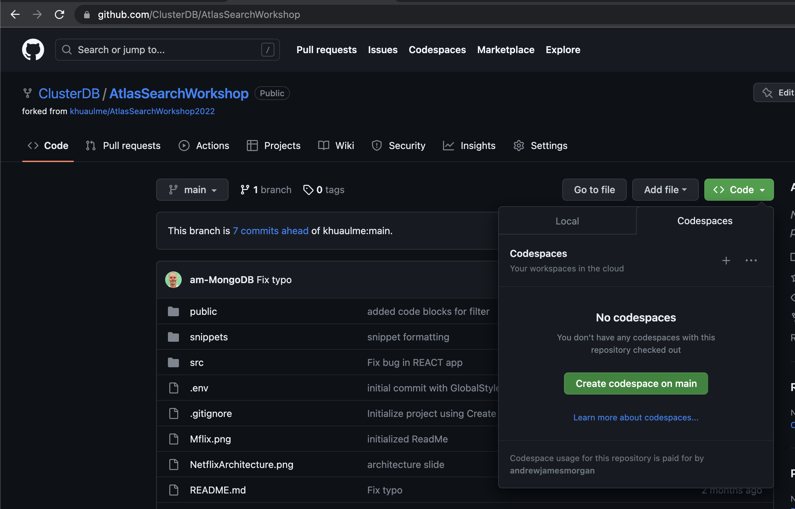

# Atlas Search Workshop
[Session slides](SearchWorkshopSlides.pdf)
## Steps
### 1. Add sample data to your MongoDB Atlas cluster

If you haven't already sone so, [create an Atlas cluster](https://cloud.mongodb.com/).

Make sure at least 1 user with read-write access has been added.

Make sure that IP Access List allows access (add `Allow ACCESS FROM ANYWHERE`(`0.0.0.0\0`) to be sure).

Add sample data:
- Click the `...` next to your cluster in the Atlas UI
- Select `Load Sample Dataset`

It will take a few minutes for the sample data to be added.

### 2. Add default Search index
- Keep the name as `default`
- Databse: `sample_mflix`
- Collection: `movies`
- Leave `Dynamic Mapping` turned on

### 3. Add autocomplete index
- Set the name to `autocomplete`
- Turn off `Dynamic Mapping`
- Click `Refine Your Index`
- Add a new field mapping for the `title` field with a `Data Type` of `Autocomplete`

### 4. (OPTIONAL) Connect MongoDB Compass
You can get the URL from the Atlas UI - click the `Connect` button next to your cluster.

Paste the URL into the Compass connection box, replacing the username and password.

### 5. Create aggregation pipeline to search for movies
From Compass (or the Atlas UI), navigate to the `Aggregation` pane for `sample_mflix.movies`.

Create these stages in sequence:

#### a. `$search`
```js
{
  index: 'default',
  text: {
    query: 'Indiana Ones',
    path: ['plot', 'fullplot', 'title'],
    fuzzy: {}
  },
  highlight: {path: 'fullplot'}
}
```

#### b. `$limit`
```
12
```

#### c. `$project`
```js
{
  title: 1,
  year: 1,
  poster: 1,
  plot: 1, 
  imdb: 1,
  score: {$meta: 'searchScore'},
  highlights: {
    '$meta': 'searchHighlights'
  }
}
```

- Click `EXPORT TO LANGUAGE`
- Choose `NODE` as the export language
- Copy the code and keep it safe
- Save the pipeline if using Compass

### 6. Create and test a HTTPS endpoint to search for movies
- Create a new Atlas App Service and name it `Movies`.
- Select `Functions` and then `Create New Function`.
- Set `Authentication` to `System`, and then `Save Draft`.
- Use this template for the function code:
```js
exports = async function({ query, headers, body}, response) {
    
    // GET A HANDLE TO THE MOVIES COLLECTION
    const moviesCollection = context.services.get("mongodb-atlas").db("sample_mflix").collection("movies");
    
    // GET SEARCHTERM FROM QUERY PARAMETER. IF NONE, RETURN EMPTY ARRAY
    let searchTerm = query.searchTerm;
    if (!query.searchTerm || searchTerm === ""){
         return [];
    }
  
    const searchAggregation = [];  
    return await moviesCollection.aggregate(searchAggregation).toArray();
};
```
- Replace the `[]` for `searchAggregation` with your aggregation pipeline
- Replace `Indiana Ones` with `searchTerm`
- `Save Draft`
- Select `HTTPS Endpoints`
- `Add An Endpoint`
- `Route`: `/movies'
- `HTTP Method`: `GET`
- Enable `Respond With Result`
- `Function`: the function you just created
- `Save Draft`
- `REVIEW DRAFT & DEPLOY`
- Copy the URL -> `<baseURL>`
- From a browser, paste the URL into the location bar (`<baseURL>?searchTerm=blues`). This will search for movies that mention `blues` - replace it with your own string (using `%20` for spaces - e.g., `blues%20brothers`)

### 7. Create aggregation pipeline to autocomplete movie titles
From Compass (or the Atlas UI), navigate to the `Aggregation` pane for `sample_mflix.movies`.

Create these stages in sequence:

#### a. `$search`
```js
{
  index: 'autocomplete',
  autocomplete: {
    query: 'Indiana J',
    path: 'title'
  }
}
```
#### b. `$limit`
```js
10
```
#### c. `$project`
```js
{
  _id: 0,
  title: 1
}
```

### 8. Create and test a HTTPS endpoint to autocomplete movie titles
- Open your `Movies` Atlas App Service.
- Select `Functions` and then `Create New Function`.
- Set `Authentication` to `System`, and then `Save Draft`.
- Use this template for the function code:
```js
exports = async function({ query, headers, body}, response) {
  
  // GET A HANDLE TO THE MOVIES COLLECTION
  const moviesCollection = context.services.get("mongodb-atlas").db("sample_mflix").collection("movies");
  
  // GET SEARCHTERM FROM QUERY PARAMETER. IF NONE, RETURN EMPTY ARRAY
  let searchTerm = query.searchTerm;

  if (!query.searchTerm || searchTerm ===""){
    return [];
  }
  
  const searchAggregation =[];

  return await moviesCollection.aggregate(searchAggregation).toArray();
};
```
- Replace the `[]` for `searchAggregation` with your aggregation pipeline
- Replace `Indiana Ones` with `searchTerm`
- `Save Draft`
- Select `HTTPS Endpoints`
- `Add An Endpoint`
- `Route`: `/titles'
- `HTTP Method`: `GET`
- Enable `Respond With Result`
- `Function`: the function you just created
- `Save Draft`
- `REVIEW DRAFT & DEPLOY`
- Copy the URL -> `<baseURL>`
- From a browser, paste the URL into the location bar (`<baseURL>?searchTerm=blues`). This will search for movies that mention `blues` - replace it with your own string (using `%20` for spaces - e.g., `blues%20brothers`)

## OPTIONAL: Use your new API from a REACT web app

This repo includes a REACT movie-search web app which is able to use the two HTTP endpoints you've just created.

To download and start the app (if you're able to install Node.js on your machine):
```bash
git clone git@github.com:ClusterDB/AtlasSearchWorkshop.git
cd AtlasSearchWorkshop
npm install
npm start
```

To download and start the app (if you're **not** able to install Node.js on your machine):

Create a CodeSpace (you must be logged in to GitHub):



You should then wait for the installation to complete in the terminal window. Once complete, start the app by running 'npm start' from the CodeSpace terminal.

The web app should open in a browser window. If you try searching for anything, you should get a message that you need to set up the HTTPS endpoints.

To make the app work, you need to add your endpoints to `src/components/Home.js` (line 22) and `src/components/SearchBar/SearchBar.js` (line 15).

When you save the files, the app should rebuild - you may need to refresh the browser window.

## Final demo

A quick demo of some of the features of Atlas Search (including the queries) using [Restaurant Finder](https://www.atlassearchrestaurants.com/). Code can be found [here](https://github.com/mongodb-developer/WhatsCooking).